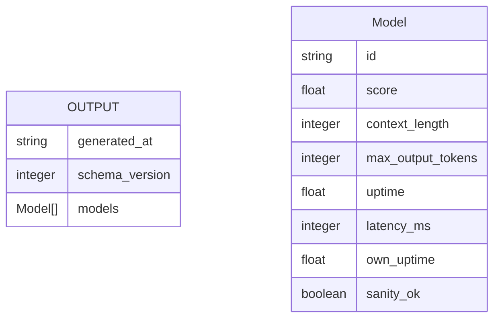

# Architecture Overview

This repository implements a **daily-refreshed, scored model list pipeline** for OpenRouter free models. The pipeline runs via a scheduled GitHub Actions workflow and produces profile-specific `models-*.json` files that consumers point their `model_list_url` at.

## High-Level Data Flow

<!-- openwiki: mermaid parse failed and this diagram was converted to a text fence so it does not break rendering. Fix the diagram source and restore the mermaid fence. Parser error: Heuristic: an unescaped angle bracket inside a label breaks rendering; rephrase the label. -->
```text
flowchart TD
    A[GitHub Actions Workflow<br/>update-models.yml<br/>Daily 03:00 UTC] --> B[generate_models.py<br/>--profile mengram]
    A --> C[generate_models.py<br/>--profile yt-summarizer]
    A --> D[generate_models.py<br/>--profile openwiki]
    A --> E[fetch_anthropic_models.py<br/>Weekly Tue 03:00 UTC]

    B --> F[models-mengram.json]
    C --> G[models-yt-summarizer.json]
    D --> H[models-openwiki.json]
    E --> I[anthropic-models.json]

    subgraph Pipeline[Per-Profile Pipeline]
        B1[Fetch OpenRouter Models<br/>openrouter_client.py] --> B2[Filter Free Models<br/>filters.py]
        B2 --> B3[Apply Profile Thresholds<br/>thresholds-*.yaml]
        B3 --> B4[Fetch Endpoint Stats<br/>endpoint_stats.py]
        B4 --> B5[Probe Each Candidate<br/>probe.py]
        B5 --> B6[Read 30-Day Probe History<br/>probe.py]
        B6 --> B7[Score Candidates<br/>scoring.py]
        B7 --> B8[Write Output JSON<br/>generate_models.py]
    end

    F -.-> J[Consumers<br/>mengram, yt-summarizer, OpenWiki]
    G -.-> J
    H -.-> J
    I -.-> K[Consumers<br/>yt-summarizer Claude selector]
```

**Caption:** High-level pipeline: scheduled workflow runs per-profile generation; each profile runs the full filter→probe→score pipeline; outputs consumed by downstream tools.

## Component Architecture

<!-- openwiki: mermaid parse failed and this diagram was converted to a text fence so it does not break rendering. Fix the diagram source and restore the mermaid fence. Parser error: Heuristic: an unescaped angle bracket inside a label breaks rendering; rephrase the label. -->
```text
flowchart LR
    subgraph Scripts[scripts/]
        GM[generate_models.py<br/>Orchestrator]
        FL[filters.py<br/>Threshold filtering]
        ES[endpoint_stats.py<br/>OpenRouter endpoint stats]
        PR[probe.py<br/>Probe & history]
        SC[scoring.py<br/>Weighted scoring]
        TH[thresholds.py<br/>Load YAML + defaults]
        OR[openrouter_client.py<br/>Fetch model catalog]
    end

    subgraph Config[Config]
        TM[thresholds-mengram.yaml]
        TY[thresholds-yt-summarizer.yaml]
        TO[thresholds-openwiki.yaml]
    end

    subgraph Data[Data]
        HM[history/*.jsonl<br/>30-day rolling probes]
        MO[models-*.json<br/>Output lists]
        AM[anthropic-models.json<br/>Weekly Anthropic fetch]
    end

    subgraph External[External APIs]
        OR_API[OpenRouter API<br/>/models, /endpoints]
        ANTH_API[Anthropic API<br/>/v1/models]
    end

    GM --> FL
    GM --> ES
    GM --> PR
    GM --> SC
    GM --> TH
    GM --> OR
    FL --> TM
    FL --> TY
    FL --> TO
    PR --> HM
    GM --> MO
    ES --> OR_API
    PR --> OR_API
    OR --> OR_API
    E --> ANTH_API
    E[fetch_anthropic_models.py] --> AM
```

**Caption:** Component diagram: scripts, config, data, and external API dependencies.

## Pipeline Stages (Per Profile)

| Stage | Script | Input | Output | Key Logic |
|-------|--------|-------|--------|-----------|
| 1. Fetch catalog | `openrouter_client.py` | `OPENROUTER_API_KEY` | `List[Model]` | `GET /api/v1/models` |
| 2. Filter free | `filters.py::is_free` | All models | Free models | `pricing.prompt == "0" && pricing.completion == "0"` |
| 3. Apply thresholds | `filters.py::filter_candidates` | Free models + thresholds | Candidates | Hard floor `min_param_b`; buffered `min_context_length`, `min_max_output_tokens`; `allowlist`/`hardallowlist`; `require_structured_output`, `require_tools`; relax `buffer_pct` to meet `min_candidate_pool` |
| 4. Endpoint stats | `endpoint_stats.py` | Candidate IDs | `uptime`, `latency_p50` (avg over free endpoints) | `GET /models/{id}/endpoints`, average free endpoints; fallback `0.5`/None on failure |
| 5. Probe | `probe.py` | Candidate IDs | `success`, `latency_ms` (recorded to history) | 1-token completion via OpenAI client; append to `history/<model>.jsonl` (30-day rolling) |
| 6. Own uptime | `probe.py::compute_uptime` | 30-day history | `own_uptime` (0-1) | `<3 samples` → `0.5` neutral; else success rate |
| 7. Post-probe filter | `scoring.py::passes_post_probe_filters` | OR uptime/latency + thresholds | Pass/fail | Optional `min_uptime`, `max_latency_ms` |
| 8. Score | `scoring.py::compute_score` | Model, OR stats, max context, own uptime | `score` (0-1) | `0.6*or_uptime + 0.3*latency_norm + 0.1*capability_norm` × `own_uptime`; latency capped at 5s; capability = `context_length / max_context` |
| 9. Sort & write | `generate_models.py` | Scored list | `models-<profile>.json` | Descending score; schema v2 |

## Data Model (Output Schema)



**Caption:** Output JSON schema (v2). `generated_at` is ISO 8601 UTC; `score` rounded to 4 decimals; `latency_ms` null if no free endpoint latency.

## Profiles

Three independent profiles, each with its own thresholds and output:

| Profile | Output File | Thresholds File | Use Case |
|---------|-------------|-----------------|----------|
| `mengram` | `models-mengram.json` | `thresholds-mengram.yaml` | mengram knowledge extraction: ≥28B params, ≥40k context, ≥8k output, structured output required |
| `yt-summarizer` | `models-yt-summarizer.json` | `thresholds-yt-summarizer.yaml` | YouTube transcript summarization: ≥14B params, ≥32k context, ≥2k output, no structured output |
| `openwiki` | `models-openwiki.json` | `thresholds-openwiki.yaml` | OpenWiki agentic doc generation: ≥70B params, ≥128k context, ≥16k output, tool-calling required |

See [Profiles & Thresholds](configuration/profiles.md) for details.

## External Dependencies

- **OpenRouter API** — Model catalog (`/models`), endpoint stats (`/models/{id}/endpoints`), completion endpoint for probes. Requires `OPENROUTER_API_KEY`.
- **Anthropic API** — Weekly model list fetch (`/v1/models`). No auth required (public endpoint).

## Deployment

- **Runtime**: GitHub Actions (`ubuntu-latest`, Python 3.11+)
- **Schedule**: Daily 03:00 UTC (`update-models.yml`); Weekly Tue 03:00 UTC (`update-anthropic-models.yml`)
- **Artifacts**: Committed JSON files pushed back to repo on change
- **History**: `history/` directory committed daily (30-day rolling probe logs)

## Related Pages

- [Model Generation Workflow](workflows/generate-models.md) — Step-by-step pipeline walkthrough
- [Profiles & Thresholds](configuration/profiles.md) — Threshold configs and profile details
- [GitHub Actions](operations/github-actions.md) — Workflow definitions and scheduling
- [Source Map](source-map.md) — File-to-concept mapping