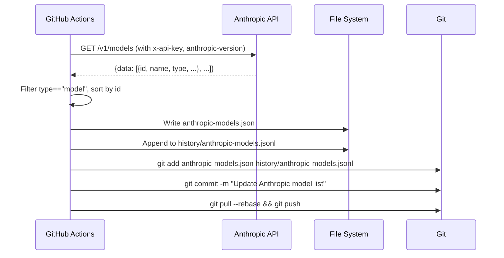

# GitHub Actions Workflows

This repository uses three GitHub Actions workflows for automated maintenance:

| Workflow | File | Schedule | Purpose |
|----------|------|----------|---------|
| **Update model lists** | `update-models.yml` | Daily 03:00 UTC | Refresh `models-mengram.json`, `models-yt-summarizer.json`, `models-openwiki.json` |
| **Update Anthropic models** | `update-anthropic-models.yml` | Weekly Tue 03:15 UTC | Fetch and commit `anthropic-models.json` |
| **OpenWiki Update** | `openwiki-update.yaml` | Bi-weekly Sat 05:00 UTC | Regenerate repository documentation via OpenWiki |

All workflows use `concurrency.group: update-model-lists` to prevent overlapping runs.

---

## 1. Update Model Lists (`update-models.yml`)

**Trigger:** Daily at 03:00 UTC + manual dispatch  
**Permissions:** `contents: write` (to commit updated JSON files)  
**Secrets required:** `SYNC_PAT` (repo write token), `OPENROUTER_API_KEY`

### Flow

```mermaid
flowchart TD
    A[Cron: 0 3 * * *] --> B[Checkout with SYNC_PAT]
    B --> C[Install uv]
    C --> D[uv sync]
    D --> E[Generate mengram profile]
    D --> F[Generate yt-summarizer profile]
    D --> G[Generate openwiki profile]
    E --> H[Commit if changed]
    F --> H
    G --> H
    H --> I[git add models-*.json history/]
    I --> J[git commit -m \"Update model lists\"]
    J --> K[git pull --rebase]
    K --> L[git push]
```

### Steps Detail

| Step | Command | Notes |
|------|---------|-------|
| Checkout | `actions/checkout@v7` | Uses `SYNC_PAT` for write access |
| Install uv | `astral-sh/setup-uv@v9.0.0` | Fast Python package installer |
| Install deps | `uv sync` | Installs from `pyproject.toml` |
| Generate mengram | `uv run scripts/generate_models.py --profile mengram` | `OPENROUTER_API_KEY` in env |
| Generate yt-summarizer | `uv run scripts/generate_models.py --profile yt-summarizer` | Same API key |
| Generate openwiki | `uv run scripts/generate_models.py --profile openwiki` | Same API key |
| Commit | `git add ... && git diff --cached --quiet \|\| git commit` | Only commits if files changed |

### Output Files Committed

- `models-mengram.json`
- `models-yt-summarizer.json`
- `models-openwiki.json`
- `history/` (all `*.jsonl` probe history files, 30-day rolling)

### Failure Modes

- **OpenRouter API failure** → Step fails, workflow fails, no commit
- **No free endpoints for a model** → Warning logged, neutral uptime used, model still scored
- **Probe failure** → Warning logged, failure recorded in history, `sanity_ok: false` in output
- **Git push conflict** → `git pull --rebase` handles most cases; concurrent workflow blocked by concurrency group

---

## 2. Update Anthropic Models (`update-anthropic-models.yml`)

**Trigger:** Weekly Tuesday 03:15 UTC (offset from daily to avoid conflict) + manual dispatch  
**Permissions:** `contents: write`  
**Secrets required:** `SYNC_PAT`, `ANTHROPIC_API_KEY`

### Flow



### Inline Python Script

The workflow runs a Python one-liner to normalize the response:

```python
import json, sys, datetime
from datetime import timezone

raw = json.load(sys.stdin)
models = [m for m in raw.get('data', []) if m.get('type') == 'model']
models.sort(key=lambda m: m['id'])

with open('anthropic-models.json', 'w') as f:
    json.dump(models, f, indent=2)
    f.write('\n')

entry = {
    'timestamp': datetime.datetime.now(timezone.utc).strftime('%Y-%m-%dT%H:%M:%SZ'),
    'models': models
}
with open('history/anthropic-models.jsonl', 'a') as f:
    f.write(json.dumps(entry, separators=(',', ':')) + '\n')
```

### Output Files Committed

- `anthropic-models.json` — Array of `{id, name}` for current Anthropic models (type=="model" only), sorted by `id`
- `history/anthropic-models.jsonl` — Rolling log with timestamp and full model list per fetch

### Schedule Note

Runs at **03:15 UTC Tuesday** (cron `15 3 * * 2`), 15 minutes after the daily model list workflow to avoid API rate limit contention.

---

## 3. OpenWiki Update (`openwiki-update.yaml`)

**Trigger:** Bi-weekly Saturday 05:00 UTC (even ISO weeks only) + manual dispatch  
**Permissions:** `contents: write`, `pull-requests: write`  
**Secrets required:** `OPENROUTER_API_KEY`, `LANGSMITH_API_KEY`, `SYNC_PAT` (implied by checkout)

### Flow

<!-- openwiki: mermaid parse failed and this diagram was converted to a text fence so it does not break rendering. Fix the diagram source and restore the mermaid fence. Parser error: Heuristic: a semicolon inside a label breaks rendering; rephrase the label. -->
```text
flowchart TD
    A[Cron: 0 5 * * 6<br/>Saturday 05:00 UTC] --> B[Gate: Check ISO week parity]
    B --> C{Even week?}
    C -->|No| D[Skip: echo \"Odd ISO week; skipping\"]
    C -->|Yes| E[Checkout]
    E --> F[Setup Node.js 24]
    F --> G[npm install -g openwiki]
    G --> H[Fetch models-openwiki.json<br/>Pick top sanity_ok model]
    H --> I[Run: openwiki code --update --print]
    I --> J[Create PR with openwiki/ changes]
```

### Gate Job (Week Parity)

GitHub cron cannot express "every other week", so a gate job checks ISO week parity:

```bash
week=$(( 10#$(date -u +%V) % 2 ))
if [ "$week" -eq 0 ]; then
  echo "run=true" >> "$GITHUB_OUTPUT"
else
  echo "run=false" >> "$GITHUB_OUTPUT"
  echo "Odd ISO week; skipping this run."
fi
```

- **Even ISO week** (week % 2 == 0) → proceeds to update job
- **Odd ISO week** → skips update job
- **Manual dispatch** (`workflow_dispatch`) → always runs (`run=true`)

### Model Selection

Before running OpenWiki, the workflow picks the best model from `models-openwiki.json`:

```bash
MODEL=$(curl -sf https://raw.githubusercontent.com/smoochy/openrouter-model-list/main/models-openwiki.json \
  | jq -r '[.models[] | select(.sanity_ok)][0].id // empty')
```

- Fetches the latest `models-openwiki.json` from the repo
- Filters to `sanity_ok: true` models
- Takes the **first** (highest-scored) model
- Fails if no sanity-ok model exists

### OpenWiki Execution

```bash
openwiki code --update --print
```

Environment variables:
- `OPENWIKI_TELEMETRY_DISABLED: "1"`
- `OPENWIKI_PROVIDER: openrouter`
- `OPENROUTER_API_KEY: ${{ secrets.OPENROUTER_API_KEY }}`
- `OPENWIKI_MODEL_ID: <selected model>`
- `OPENWIKI_PROVIDER_RETRY_ATTEMPTS: "10"` (handles OpenRouter free tier 429s)
- `LANGSMITH_ENDPOINT: https://eu.api.smith.langchain.com`
- `LANGSMITH_API_KEY: ${{ secrets.LANGSMITH_API_KEY }}`
- `LANGCHAIN_PROJECT: openwiki`
- `LANGCHAIN_TRACING_V2: "true"`

### PR Creation

Uses `peter-evans/create-pull-request@v8`:
- Branch: `openwiki/update`
- Commit message: `"docs: update OpenWiki"`
- Title: `"docs: update OpenWiki"`
- Paths: `openwiki/`, `CLAUDE.md`
- Auto-merges not enabled (PR requires review)

---

## Concurrency Control

All three workflows share:
```yaml
concurrency:
  group: update-model-lists
  cancel-in-progress: false
```

- **`cancel-in-progress: false`** — Running workflows are not cancelled; new triggers queue up
- Prevents simultaneous OpenRouter API calls from multiple workflows
- Daily + weekly + bi-weekly can run sequentially without conflict

---

## Required Secrets

| Secret | Used By | Purpose |
|--------|---------|---------|
| `SYNC_PAT` | All workflows | GitHub token with `contents:write` for committing/pushing |
| `OPENROUTER_API_KEY` | `update-models.yml`, `openwiki-update.yaml` | OpenRouter API access for model catalog, endpoints, probes, and OpenWiki LLM calls |
| `ANTHROPIC_API_KEY` | `update-anthropic-models.yml` | Anthropic API access for model list |
| `LANGSMITH_API_KEY` | `openwiki-update.yaml` | LangSmith tracing for OpenWiki runs |

---

## Manual Dispatch

All workflows support `workflow_dispatch` for on-demand runs:
- Go to **Actions** → select workflow → **Run workflow**
- Useful for immediate updates after threshold changes or API issues

---

## Monitoring & Debugging

- **Workflow runs**: GitHub Actions tab → filter by workflow
- **Logs**: Each step expands to show stdout/stderr
- **Warnings**: Probe failures, missing endpoint stats, allowlist exclusions appear in step logs
- **History**: `history/` directory committed daily shows 30-day probe trends
- **PRs**: OpenWiki updates create PRs for review before merging

---

## Adding a New Profile to Daily Workflow

1. Create `thresholds-<name>.yaml` and add to `PROFILES` in `generate_models.py`
2. Add step to `update-models.yml`:
   ```yaml
   - name: Generate models-<name>.json
     run: uv run scripts/generate_models.py --profile <name>
     env:
       OPENROUTER_API_KEY: ${{ secrets.OPENROUTER_API_KEY }}
   ```
3. Add output file to commit step:
   ```yaml
   git add models-<name>.json models-mengram.json models-yt-summarizer.json models-openwiki.json history/
   ```

---

## Related Pages

- [Model Generation Workflow](workflows/generate-models.md) — Pipeline executed by the daily workflow
- [Profiles & Thresholds](configuration/profiles.md) — Threshold configs for each profile
- [Architecture Overview](architecture/overview.md) — High-level system design
- [Source Map](source-map.md) — File-to-concept mapping