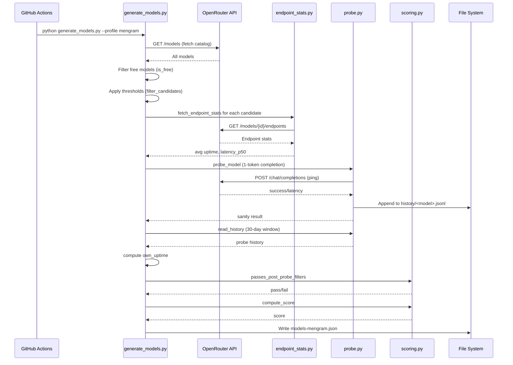

# Model Generation Workflow

This page documents the **per-profile model generation pipeline** executed by `scripts/generate_models.py`. Each profile (`mengram`, `yt-summarizer`, `openwiki`) runs the same pipeline with different thresholds from `thresholds-*.yaml`.

## Pipeline Overview



**Caption:** Sequence diagram of the per-profile generation pipeline.

## Step-by-Step Walkthrough

### 1. Entry Point: `generate_models.py`

```python
# Called via CLI: python scripts/generate_models.py --profile <name>
# Resolves profile to thresholds_path and output_path
profile = resolve_profile(args.profile)  # {"thresholds_path", "output_path"}
generate(
    thresholds_path=profile["thresholds_path"],
    history_dir=HISTORY_DIR,
    output_path=profile["output_path"],
    fetch_models_fn=fetch_models,
    fetch_endpoint_stats_fn=fetch_endpoint_stats,
    probe_model_fn=probe_model,
    llm_client=OpenAI(...),
    now=datetime.now(timezone.utc).isoformat().replace("+00:00", "Z"),
)
```

<!-- openwiki: broken internal link [../scripts/generate_models.py] file "../scripts/generate_models.py" does not exist. Fix the href or restore the target, then delete this comment. -->
**Source:** [`scripts/generate_models.py`](../scripts/generate_models.py) lines 37-100

### 2. Fetch OpenRouter Catalog: `openrouter_client.py::fetch_models`

```python
def fetch_models(api_key: str) -> list[dict]:
    response = httpx.get(
        "https://openrouter.ai/api/v1/models",
        headers={"Authorization": f"Bearer {api_key}"},
        timeout=30,
    )
    response.raise_for_status()
    return response.json()["data"]
```

Returns full model catalog with fields: `id`, `name`, `pricing`, `context_length`, `top_provider.max_completion_tokens`, `supported_parameters`, etc.

<!-- openwiki: broken internal link [../scripts/openrouter_client.py] file "../scripts/openrouter_client.py" does not exist. Fix the href or restore the target, then delete this comment. -->
**Source:** [`scripts/openrouter_client.py`](../scripts/openrouter_client.py)

### 3. Filter Free Models: `filters.py::is_free`

```python
def is_free(model: dict) -> bool:
    pricing = model.get("pricing", {})
    return pricing.get("prompt") == "0" and pricing.get("completion") == "0"
```

Keeps only models where both prompt and completion pricing are `"0"` (string).

<!-- openwiki: broken internal link [../scripts/filters.py] file "../scripts/filters.py" does not exist. Fix the href or restore the target, then delete this comment. -->
**Source:** [`scripts/filters.py`](../scripts/filters.py) lines 20-22

### 4. Apply Thresholds: `filters.py::filter_candidates`

This is the core filtering logic. Order of operations:

1. **Separate hardallowlist** — Models in `hardallowlist` bypass ALL thresholds (except they still get probed/scored)
2. **Process allowlist** — Models in `allowlist` bypass `min_param_b` and context/output thresholds, but MUST pass `require_structured_output` and `require_tools` (if enabled)
3. **Filter remaining by `min_param_b`** — Parse param count from model ID (e.g., `qwen/qwen3-32b:free` → 32). Models without parseable size are excluded.
4. **Apply buffered context/output thresholds** — `min_context_length * (1 + buffer_pct/100)`, `min_max_output_tokens * (1 + buffer_pct/100)`
5. **Apply feature requirements** — `require_structured_output` checks `supported_parameters` for `response_format` or `structured_outputs`; `require_tools` checks for `tools` or `tool_choice`
6. **Relax buffer** — If `len(allowed) + len(candidates) < min_candidate_pool`, decrement `buffer_pct` by 1 and retry (down to 0). `min_param_b` NEVER relaxes.
7. **Return** `allowed + candidates`

<!-- openwiki: broken internal link [../scripts/filters.py] file "../scripts/filters.py" does not exist. Fix the href or restore the target, then delete this comment. -->
**Source:** [`scripts/filters.py`](../scripts/filters.py) lines 35-107

### 5. Fetch Endpoint Stats: `endpoint_stats.py::fetch_endpoint_stats`

```python
# For each candidate model:
url = f"https://openrouter.ai/api/v1/models/{model_id}/endpoints"
# GET with Authorization header
# Filter endpoints where pricing.prompt == "0" and pricing.completion == "0"
# Average uptime_last_1d (divide by 100) and latency_last_30m.p50 across free endpoints
```

Returns `{"uptime": float, "latency_p50": float|None}` or `None` if request fails or no free endpoints.

**Fallback:** If `None`, use `NEUTRAL_UPTIME = 0.5` and `latency_p50 = None`.

<!-- openwiki: broken internal link [../scripts/endpoint_stats.py] file "../scripts/endpoint_stats.py" does not exist. Fix the href or restore the target, then delete this comment. -->
**Source:** [`scripts/endpoint_stats.py`](../scripts/endpoint_stats.py)

### 6. Probe Candidate: `probe.py::probe_model`

```python
def probe_model(client, model_id: str) -> dict:
    start = time.monotonic()
    try:
        client.chat.completions.create(
            model=model_id,
            messages=[{"role": "user", "content": "ping"}],
            max_tokens=1,
        )
        success = True
    except Exception:
        success = False
    latency_ms = int((time.monotonic() - start) * 1000)
    return {"success": success, "latency_ms": latency_ms}
```

Sends a minimal 1-token completion via OpenAI client (pointing at OpenRouter). Records result to history.

<!-- openwiki: broken internal link [../scripts/probe.py] file "../scripts/probe.py" does not exist. Fix the href or restore the target, then delete this comment. -->
**Source:** [`scripts/probe.py`](../scripts/probe.py) lines 11-24

### 7. Record Probe History: `probe.py::record_probe`

```python
def record_probe(history_dir: Path, model_id: str, result: dict, timestamp: str):
    # Append to history/<safe_model_id>.jsonl
    # Trim entries older than 30 days (HISTORY_WINDOW_DAYS)
```

History file: `history/google__gemma-4-31b-it__free.jsonl` (slashes/colons → `__`)

Each line: `{"timestamp": "2026-01-15T03:00:00Z", "success": true, "latency_ms": 1234}`

<!-- openwiki: broken internal link [../scripts/probe.py] file "../scripts/probe.py" does not exist. Fix the href or restore the target, then delete this comment. -->
**Source:** [`scripts/probe.py`](../scripts/probe.py) lines 27-41

### 8. Compute Own Uptime: `probe.py::compute_uptime` / `scoring.py::compute_uptime`

```python
def compute_uptime(history: list[dict]) -> float:
    if len(history) < 3:  # MIN_SAMPLES_FOR_UPTIME
        return 0.5  # NEUTRAL_UPTIME
    successes = sum(1 for e in history if e["success"])
    return successes / len(history)
```

- **<3 probes** → neutral `0.5` (malus doesn't penalize new models)
- **≥3 probes** → actual success rate (0.0–1.0)
- Used as multiplicative malus on final score

<!-- openwiki: broken internal link [../scripts/scoring.py] file "../scripts/scoring.py" does not exist. Fix the href or restore the target, then delete this comment. -->
**Source:** [`scripts/scoring.py`](../scripts/scoring.py) lines 12-16

### 9. Post-Probe Filters: `scoring.py::passes_post_probe_filters`

```python
def passes_post_probe_filters(uptime: float, latency_p50: float|None, thresholds: dict) -> bool:
    if thresholds.get("min_uptime") is not None and uptime < thresholds["min_uptime"]:
        return False
    if thresholds.get("max_latency_ms") is not None and latency_p50 is not None and latency_p50 > thresholds["max_latency_ms"]:
        return False
    return True
```

Optional filters applied AFTER probing. Currently unused (both `min_uptime` and `max_latency_ms` are empty in all thresholds files).

<!-- openwiki: broken internal link [../scripts/scoring.py] file "../scripts/scoring.py" does not exist. Fix the href or restore the target, then delete this comment. -->
**Source:** [`scripts/scoring.py`](../scripts/scoring.py) lines 29-36

### 10. Score Candidates: `scoring.py::compute_score`

```python
# Weights
UPTIME_WEIGHT = 0.6
LATENCY_WEIGHT = 0.3
CAPABILITY_WEIGHT = 0.1
LATENCY_CAP_MS = 5000

def compute_score(model, or_uptime, or_latency_p50, max_context, own_uptime):
    # Latency normalized: 1 - (latency / 5000), clamped to [0, 1]
    latency_norm = 0.0 if or_latency_p50 is None else max(0.0, 1 - or_latency_p50 / 5000)
    
    # Capability: model's context / max context in pool
    capability_norm = model["context_length"] / max_context if max_context > 0 else 0.0
    
    # Base weighted score
    base = (0.6 * or_uptime + 0.3 * latency_norm + 0.1 * capability_norm)
    
    # Apply own-uptime malus
    return base * own_uptime
```

**Score components:**
- **60% OpenRouter uptime** — Aggregated `uptime_last_1d` across free endpoints
- **30% Normalized latency** — `1 - (p50_latency / 5000ms)`, so <5s latency contributes positively
- **10% Capability** — Relative context length within candidate pool
- **Own uptime malus** — Multiplies base score by 30-day probe success rate (0.5 neutral for new models)

<!-- openwiki: broken internal link [../scripts/scoring.py] file "../scripts/scoring.py" does not exist. Fix the href or restore the target, then delete this comment. -->
**Source:** [`scripts/scoring.py`](../scripts/scoring.py) lines 39-66

### 11. Sort & Write Output: `generate_models.py`

```python
scored.sort(key=lambda m: m["score"], reverse=True)

output = {
    "generated_at": now,
    "schema_version": 2,
    "models": scored,
}

with open(output_path, "w") as f:
    json.dump(output, f, indent=2)
```

Output schema (v2):
```json
{
  "generated_at": "2026-01-15T03:00:00Z",
  "schema_version": 2,
  "models": [
    {
      "id": "google/gemma-4-31b-it:free",
      "score": 0.5234,
      "context_length": 32768,
      "max_output_tokens": 8192,
      "uptime": 0.98,
      "latency_ms": 1200,
      "own_uptime": 0.5,
      "sanity_ok": true
    }
  ]
}
```

<!-- openwiki: broken internal link [../scripts/generate_models.py] file "../scripts/generate_models.py" does not exist. Fix the href or restore the target, then delete this comment. -->
**Source:** [`scripts/generate_models.py`](../scripts/generate_models.py) lines 94-100

## Profile Differences

| Aspect | mengram | yt-summarizer | openwiki |
|--------|---------|---------------|----------|
| `min_param_b` | 28 | 14 | 70 |
| `min_context_length` | 40,000 | 32,000 | 128,000 |
| `min_max_output_tokens` | 8,000 | 2,000 | 16,000 |
| `require_structured_output` | true | false | false |
| `require_tools` | false | false | true |
| `buffer_pct` | 5 | 5 | 5 |
| `min_candidate_pool` | 3 | 3 | 2 |
| `allowlist` | `openrouter/owl-alpha` | `meta-llama/llama-4-scout:free`, `openrouter/owl-alpha`, `qwen/qwen3-32b:free` | (empty) |
| `hardallowlist` | (empty) | (empty) | (empty) |

<!-- openwiki: broken internal link [configuration/profiles.md] file "configuration/profiles.md" does not exist. Fix the href or restore the target, then delete this comment. -->
See [Profiles & Thresholds](configuration/profiles.md) for full threshold details.

## Error Handling & Warnings

- **No free endpoint stats** → Log warning, use neutral uptime (0.5), no latency score
- **Probe fails** → Log warning, record failure to history, `sanity_ok: false` in output
- **Allowlisted model missing structured output** → Log warning, exclude from candidates
- **Allowlisted model missing tool-calling** → Log warning, exclude from candidates
- **HTTP errors** → `fetch_endpoint_stats` returns `None`; `fetch_models` raises on failure

All warnings printed to stderr (visible in GitHub Actions logs).

## Running Locally

```bash
# Install deps
uv sync  # or pip install -e .[dev]

# Set API key
export OPENROUTER_API_KEY="sk-or-..."

# Run for a profile
uv run python scripts/generate_models.py --profile mengram
uv run python scripts/generate_models.py --profile yt-summarizer
uv run python scripts/generate_models.py --profile openwiki

# Run tests
uv run pytest
```

## Related Pages

<!-- openwiki: broken internal link [architecture/overview.md] file "architecture/overview.md" does not exist. Fix the href or restore the target, then delete this comment. -->
- [Architecture Overview](architecture/overview.md) — High-level system design
<!-- openwiki: broken internal link [configuration/profiles.md] file "configuration/profiles.md" does not exist. Fix the href or restore the target, then delete this comment. -->
- [Profiles & Thresholds](configuration/profiles.md) — Threshold configuration details
<!-- openwiki: broken internal link [operations/github-actions.md] file "operations/github-actions.md" does not exist. Fix the href or restore the target, then delete this comment. -->
- [GitHub Actions](operations/github-actions.md) — Scheduled workflow execution
<!-- openwiki: broken internal link [source-map.md] file "source-map.md" does not exist. Fix the href or restore the target, then delete this comment. -->
- [Source Map](source-map.md) — File-to-concept mapping